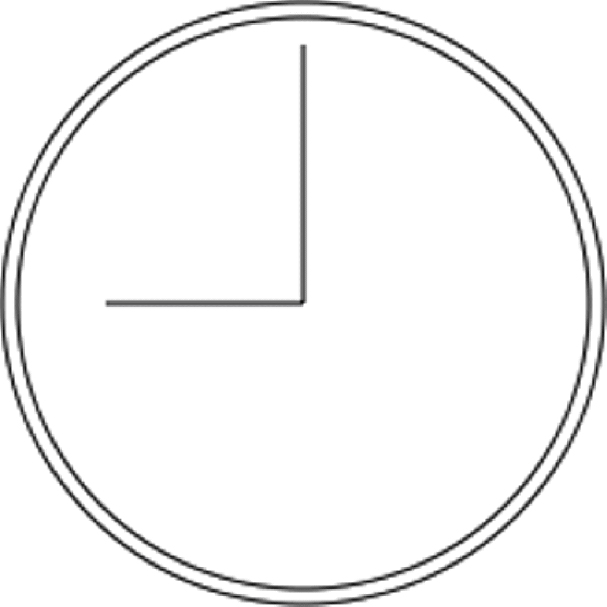

# 动画与 canvas

## requestAnimationFrame

- 实际上可以接收一个参数 表示下次重绘的时间

```js
unction updateProgress() {
  var div = document.getElementById("status");
  div.style.width = (parseInt(div.style.width, 10) + 5) + "%";
  if (div.style.left != "100%") {
  requestAnimationFrame(updateProgress);
  }
}
requestAnimationFrame(updateProgress);
```

### cancelAnimationFrame

requestAnimationFrame()也返回一个请求 ID，可以用于通过另一个方法 cancelAnimationFrame()来取消重绘任务

```js
let requestID = window.requestAnimationFrame(() => {
  console.log('Repaint!')
})
window.cancelAnimationFrame(requestID)
```

## 基本画布 canvas

```html
<canvas id="drawing" width="200" height="200">A drawing of something.</canvas>
```

```js
let drawing = document.getElementById('drawing')

// 确保浏览器支持<canvas>
if (drawing.getContext) {
  let context = drawing.getContext('2d')

  // 其他代码
}
// 获取一张png图片
// 取得图像的数据URI
let imgURI = drawing.toDataURL('image/png')

// 显示图片
let image = document.createElement('img')
image.src = imgURI
document.body.appendChild(image)
```

## 2D 绘图

- 填充和描边

  - fillStyle
  - strokeStyle

- 绘制矩形
  - fillRect(x, y, width, height)
  - strokeRect(x, y, width, height)
  - clearRect(x, y, width, height)
- 绘制路径
  - beginPath()
  - closePath()
  - moveTo(x, y)
  - lineTo(x, y)
  - quadraticCurveTo(cpx, cpy, x, y)

### 1.显示效果取决于两个属性：fillStyle 和 strokeStyle

1. fillStyle 属性决定了绘制图形填充的颜色或渐变
2. strokeStyle 属性决定了绘制图形轮廓的颜色或渐变

```js
let drawing = document.getElementById('drawing')

// 确保浏览器支持<canvas>
if (drawing.getContext) {
  let context = drawing.getContext('2d')
  context.strokeStyle = 'red'
  context.fillStyle = '#0000ff'
}
```

### 2.与绘制矩形相关的方法有 3 个：fillRect()、strokeRect()和 clearRect()

1. fillRect()方法用于以指定颜色在画布上绘制并填充矩形
2. strokeRect()方法使用通过 strokeStyle 属性指定的颜色绘制矩形轮廓
3. clearRect()方法可以擦除画布中某个区域

```js
let drawing = document.getElementById('drawing')

// 确保浏览器支持<canvas>
if (drawing.getContext) {
  let context = drawing.getContext('2d')

  /*
   * 引自MDN文档
   */

  // 绘制红色矩形
  context.fillStyle = '#ff0000'
  context.fillRect(10, 10, 50, 50)

  // 绘制半透明蓝色矩形
  context.fillStyle = 'rgba(0,0,255,0.5)'
  context.fillRect(30, 30, 50, 50)

  // 绘制红色轮廓的矩形
  context.strokeStyle = '#ff0000'
  context.strokeRect(10, 10, 50, 50)

  // 在前两个矩形重叠的区域擦除一个矩形区域
  context.clearRect(40, 40, 10, 10)
}
```

### 3.绘制路径

- arc(x, y, radius, startAngle, endAngle, counterclockwise)：以坐标(x, y)为圆心，以 radius 为半径绘制一条弧线，起始角度为 startAngle，结束角度为 endAngle（都是弧度）。最后一个参数 counterclockwise 表示是否逆时针计算起始角度和结束角度（默认为顺时针）。
- arcTo(x1, y1, x2, y2, radius)：以给定半径 radius，经由(x1, y1)绘制一条从上一点到(x2, y2)的弧线。
  bezierCurveTo(c1x, c1y, c2x, c2y, x, y)：以(c1x, c1y)和(c2x, c2y)为控制点，绘制一条从上一点到(x, y)的弧线（三次贝塞尔曲线）。
- lineTo(x, y)：绘制一条从上一点到(x, y)的直线。
- moveTo(x, y)：不绘制线条，只把绘制光标移动到(x, y)。
- quadraticCurveTo(cx, cy, x, y)：以(cx, cy)为控制点，绘制一条从上一点到(x, y)的弧线（二次贝塞尔曲线）。
- rect(x, y, width, height)：以给定宽度和高度在坐标点(x, y)绘制一个矩形。这个方法与 strokeRect()和 fillRect()的区别在于，它创建的是一条路径，而不是独立的图形。

```js
let drawing = document.getElementById('drawing')

// 确保浏览器支持<canvas>
if (drawing.getContext) {
  let context = drawing.getContext('2d')

  // 创建路径
  context.beginPath()

  // 绘制外圆
  context.arc(100, 100, 99, 0, 2 * Math.PI, false)

  // 绘制内圆
  context.moveTo(194, 100)
  context.arc(100, 100, 94, 0, 2 * Math.PI, false)

  // 绘制分针
  context.moveTo(100, 100)
  context.lineTo(100, 15)

  // 绘制时针
  context.moveTo(100, 100)
  context.lineTo(35, 100)

  // 描画路径
  context.stroke()
}
```



这个例子使用 arc()绘制了两个圆形，一个外圆和一个内圆，以构成表盘的边框。外圆半径 99 像素，原点为(100,100)，也就是画布的中心。要绘制完整的圆形，必须从 0 弧度绘制到 2π 弧度（使用数学常量 Math.PI）。而在绘制内圆之前，必须先把路径移动到内圆上的一点，以避免绘制出多余的线条。第二次调用 arc()时使用了稍小一些的半径，以呈现边框效果。然后，再组合运用 moveTo()和 lineTo()分别绘制分针和时针。最后一步是调用 stroke()。

## 绘制文本
