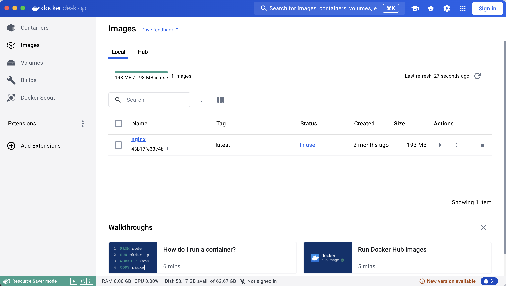

# 1.Docker 的安装

https://docs.docker.com/desktop/install/mac-install/
安装完成后，运行下面的命令，验证是否安装成功。

## 验证 Docker 是否安装成功

```shell
docker version
```

或者

```shell
docker info
```

## Docker 需要用户具有 sudo 权限，为了避免每次命令都输入 sudo

```shell
sudo usermod -aG docker $USER
```

## Docker 启动

### service 命令的用法

```shell
sudo service docker start
```

### systemctl 命令的用法

```shell
sudo systemctl start docker
```

## 列出本机的所有 image 文件

Docker 把应用程序及其依赖，打包在 image 文件里面。只有通过这个文件，才能生成 Docker 容器。image 文件可以看作是容器的模板。Docker 根据 image 文件生成容器的实例。同一个 image 文件，可以生成多个同时运行的容器实例。

```shell
docker image ls
```

## 删除 image 文件

```shell
docker image rm [imageName]
```

## 可视化工具



# 2.Docker 镜像修改地址

- 打开/etc/default/docker 文件（需要 sudo 权限），在文件的底部加上一行。
- DOCKER_OPTS="--registry-mirror=https://registry.docker-cn.com"
- 重启 Docker 服务 sudo service docker restart

# 3.容器文件

## 列出本机正在运行的容器

```shell
docker container ls
```

## 列出本机所有容器，包括终止运行的容器

```shell
docker container ls --all
```

## 删除容器文件

```shell
docker container rm [containerID]
```
